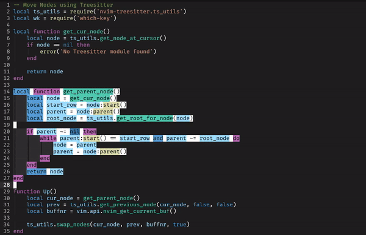

# move.nvim

Gain the power to move lines and blocks!



## Installation

-   [packer.nvim](https://github.com/wbthoason/packer.nvim)

``` lua
use 'fedepujol/move.nvim'
```

-   [vim-plug](https://github.com/junegunn/vim-plug)

``` vim
Plug 'fedepujol/move.nvim'
```

-   [paq](https://github.com/savq/paq-nvim)

``` lua
'fedepujol/move.nvim';
```

## Usage

### MoveLine

Move the cursor line up or down

#### VimScript

``` vim-script
nnoremap <silent> <A-j> lua require('move').MoveLine(1)<CR>
nnoremap <silent> <A-k> lua require('move').MoveLine(-1)<CR>

" Or use the command
nnoremap <silent> <A-j> :MoveLine(1)<CR>
nnoremap <silent> <A-k> :MoveLine(-1)<CR>
```

#### Lua

``` lua
vim.api.nvim_set_keymap('n', '<A-j>', "<Cmd>lua require('move').MoveLine(1)<CR>", { noremap = true, silent = true })
vim.api.nvim_set_keymap('n', '<A-k>', "<Cmd>lua require('move').MoveLine(-1)<CR>", { noremap = true, silent = true })

-- Or use the command
vim.api.nvim_set_keymap('n', '<A-j>', ":MoveLine(1)<CR>", { noremap = true, silent = true })
vim.api.nvim_set_keymap('n', '<A-k>', ":MoveLine(-1)<CR>", { noremap = true, silent = true })
```

### MoveBlock

Select a block of code/text and move it up or down (retains the
selection)

#### VimScript

``` vim-script
vnoremap <silent> <A-j> lua require('move').MoveBlock(1)<CR>
vnoremap <silent> <A-k> lua require('move').MoveBlock(-1)<CR>

" Or use the command
vnoremap <silent> <A-j> :MoveBlock(1)<CR>
vnoremap <silent> <A-k> :MoveBlock(-1)<CR>
```

#### Lua

``` lua
vim.api.nvim_set_keymap('v', '<A-j>', "<Cmd>lua require('move').MoveBlock(1)<CR>", { noremap = true, silent = true })
vim.api.nvim_set_keymap('v', '<A-k>', "<Cmd>lua require('move').MoveBlock(-1)<CR>", { noremap = true, silent = true })

-- Or use the command
vim.api.nvim_set_keymap('v', '<A-j>', ":MoveBlock(1)<CR>", { noremap = true, silent = true })
vim.api.nvim_set_keymap('v', '<A-k>', ":MoveBlock(-1)<CR>", { noremap = true, silent = true })
```
