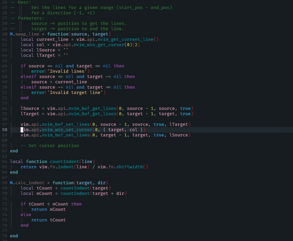
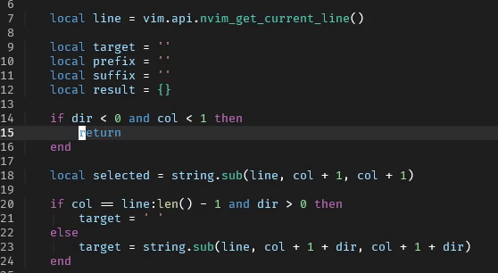
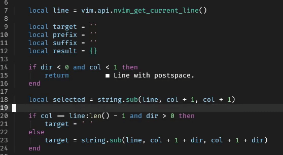

# move.nvim

Gain the power to move lines and blocks!

## Vertical Movement




## Horizontal Movement





## Requirements

This plugin works with NeoVim v0.5 or later.

## Installation

-   [packer.nvim](https://github.com/wbthomason/packer.nvim)

``` lua
use 'fedepujol/move.nvim'
```

-   [vim-plug](https://github.com/junegunn/vim-plug)

``` vim
Plug 'fedepujol/move.nvim'
```

-   [paq](https://github.com/savq/paq-nvim)

``` lua
'fedepujol/move.nvim';
```

## Usage

The plugin provides the following commands:

| Command   | Description | Mode |
|-----------|-------------|------|
| MoveLine  | Moves a line up or down | Normal |
| MoveBlock | Moves a selected block of text, up or down | Visual |
| MoveHChar | Moves the character under the cursor, left or right | Normal |
| MoveHBlock | Moves a visual area, left or right | Visual |

## Mappings

#### VimScript

``` vim-script
" Normal-mode commands
nnoremap <silent> <A-j> :MoveLine(1)<CR>
nnoremap <silent> <A-k> :MoveLine(-1)<CR>
nnoremap <silent> <A-l> :MoveHChar(1)<CR>
nnoremap <silent> <A-h> :MoveHChar(-1)<CR>

" Visual-mode commands
vnoremap <silent> <A-j> :MoveBlock(1)<CR>
vnoremap <silent> <A-k> :MoveBlock(-1)<CR>
vnoremap <silent> <A-l> :MoveHBlock(1)<CR>
vnoremap <silent> <A-h> :MoveHBlock(-1)<CR>
```

#### Lua

``` lua
local opts = { noremap = true, silent = true }
-- Normal-mode commands
vim.keymap.set('n', '<A-j>', ':MoveLine(1)<CR>', opts)
vim.keymap.set('n', '<A-k>', ':MoveLine(-1)<CR>', opts)
vim.keymap.set('n', '<A-h>', ':MoveHChar(-1)<CR>', opts)
vim.keymap.set('n', '<A-l>', ':MoveHChar(1)<CR>', opts)

-- Visual-mode commands
vim.keymap.set('v', '<A-j>', ':MoveBlock(1)<CR>', opts)
vim.keymap.set('v', '<A-k>', ':MoveBlock(-1)<CR>', opts)
vim.keymap.set('v', '<A-h>', ':MoveHBlock(-1)<CR>', opts)
vim.keymap.set('v', '<A-l>', ':MoveHBlock(1)<CR>', opts)
```

## Mention

There is an original and more feature rich plugin (written in VimScript):

[vim-move](https://github.com/matze/vim-move).
